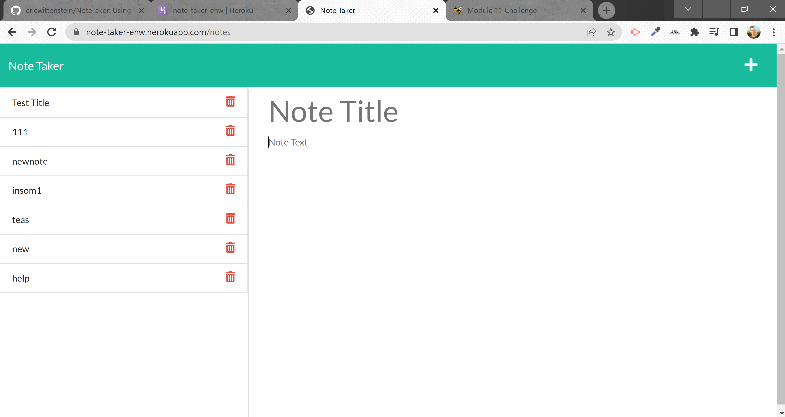

# NoteTaker


## Description

Using NodeJS and the Express package, create an application that will be able to write, save, and retrieve notes. This application is deployed to Heroku at the following link: https://note-taker-ehw.herokuapp.com/

## Table of Contents 

* [Installation](#installation)

* [Usage](#usage)

* [Contributing](#contributing)

* [Testing](#testing)

* [Questions](#questions)

## Installation

To install necessary dependencies, run the following command in the console/command line:

```
npm i
```

## Usage

Be sure to install necessary dependencies

## GitHub Repo

https://github.com/ericwittenstein/NoteTaker

## Project Demo



## Contributing

Ask first

## Testing

There are no unit tests for this project

## Questions and Contact Info

If you have any questions about the repo, please open an issue on GitHub or contact me directly at eric.wittenstein@gmail.com.

You can find more of my work at [github.com/ericwittenstein/](https://github.com/ericwittenstein/).

<!-- EHW SIGNET
---------
    |
  -----
    |
---------
 -->

### Eric Wittenstein

